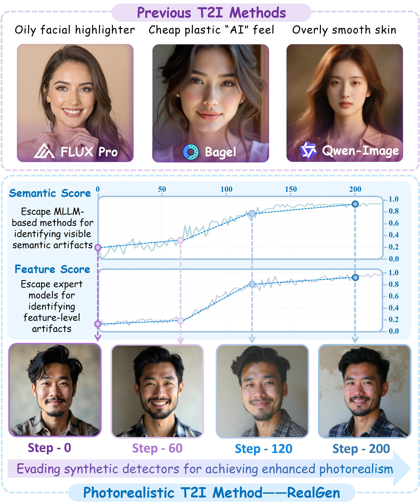

# RealGen: Photorealistic Text-to-Image Generation via Detector-Guided Rewards
<a href="https://arxiv.org/abs/2512.00473" target="_blank"></a>


## 📰 News
* **[2025.12.02]**  🔥 We have released **RealGen: Photorealistic Text-to-Image Generation via Detector-Guided Rewards**. Check out the **[** [Paper](https://arxiv.org/abs/2512.00473);  **]**. 


## 🏆 Contributions

* ✨ **What did we do?** We propose **RealGen**, a text-to-image generator capable of producing highly convincing photorealistic images. It leverages a Detector Reward-guided GRPO post-training to escape detector identification, thereby reducing artifacts and enhancing image realism and detail.
* 📐 **How to evaluate performance?** We introduce **RealBench**, a new benchmark for evaluating photorealism that achieves human-free automated scoring through Detector-Scoring and Arena-Scoring.
* 🔧 **How effective was it?** RealGen significantly outperforms both general image models (like GPT-Image-1, Qwen-Image) and specialized realistic models (like FLUX-Krea) in realism, details, and aesthetics on the T2I task.




## ✨ Comparison


## 🤗 Acknowledgement
This repo is based on [Flow GRPO](https://github.com/yifan123/flow_grpo). We thank the authors for their valuable contributions to the AlGC community.

## 🚀 Quick Started
- It should be stated that our proposed detection-for-generation framework is compatible with all diffusion-model-based GRPO paradigms, such Dance GRPO and Flow GRPO. And our implementation is primarily based on **[Flow GRPO](https://github.com/yifan123/flow_grpo)**
### 1. Environment Set Up
Diffusion model Training Framework Based on Flow GRPO：Environment Configuration Reference [Flow GRPO](https://github.com/yifan123/flow_grpo)
```bash
cd /RealGen/flow_grpo
conda create -n flow_grpo python=3.10.16
pip install -e .
```
### 2. Model Download
Please download the required models in advance.
- T2I Models：
  - FLux: black-forest-labs/FLUX.1-dev
  - SD: stabilityai/stable-diffusion-3.5-large
  - Other diffusion models
- Reward Models：
  - Detection Model: [Forensic-chat and OmniAID](https://huggingface.co/lokiz666/Realgen-detection-models) or other Fake detection models  
  - Alignment Model: Longclip, clip or other alignment models
### 3. Reward Preparation
The steps above strictly cover the installation of the core repository. Given that different reward models often depend on conflicting library versions, merging them into a single Conda environment can lead to compatibility issues. To mitigate this, please create a new Conda virtual environment and install the corresponding dependencies according to the instructions in [Reward Server](https://github.com/yifan123/reward-server)
```bash
cd /RealGen/flow_grpo/reward-server
conda create -n reward_server python=3.10.16
conda activate reward_server
pip install -e .
```
We trained task-specific detectors to serve as reward model based on an existing fake detection models:
- **Semantic Detector**: Forensic-Chat, a generalizable and interpretable detector optimized from Qwen2.5-VL-7B. It assesses authenticity by analyzing image content (e.g., smooth greasy skin, artifacts in faces/hands, unnatural background blur). 
- **Feature Detector**: OmniAID achieves stable and accurate detection by being pre-trained on large-scale real and synthetic datasets. Feature-level artifacts are primarily associated with frequency artifacts and abnormal noise patterns. 

An 8-GPU H200 training node was employed for this study, with seven GPUs allocated for the GRPO training process and one GPU reserved for hosting the reward server. Reference code for running the service:
```bash
CUDA_VISIBLE_DEVICES=7 nohup gunicorn --workers 1 --bind 127.0.0.1:18085 "app_qwenfake:create_app()" > reward_qwenfake.log 2>&1 &
CUDA_VISIBLE_DEVICES=7 nohup gunicorn --workers 1 --bind 127.0.0.1:18087 "app_effortmoe:create_app()" > reward_effort.log 2>&1 &
```
### 4. Start Training GRPO
Model parameter settings are located in `/RealGen/flow_grpo/config`, while the main files and training settings are in `/RealGen/flow_grpo/scripts`. Notably, we have also updated **[GRPO-Guard](https://jingw193.github.io/GRPO-Guard/)** to improve the capability of generating high-quality images. Below is a reference for running a selected model:
```bash
cd /RealGen/flow_grpo
conda activate flow-grpo
bash scripts/single_node/fast_grpo_flux_guard.sh
```
Additionally, if there are no environmental conflicts and GPU memory is sufficient, the reward function does not need to be deployed as a separate service. It can be modified directly in `/RealGen/flow_grpo/flow_grpo/rewards.py`. You may also refer to Flow GRPO.

The dataset is located in `/RealGen/flow_grpo/dataset/realgen`. The training set contains short prompts and their rewritten long captions covering multiple topics, such as people, animals, and architecture.
### 5. Evaluation
The inference and evaluation processes are realized according to the code in /RealGen/eval.

## 📕 BibTeX 

```bib
@article{ye2025realgen,
  title={RealGen: Photorealistic Text-to-Image Generation via Detector-Guided Rewards},
  author={Ye, Junyan and Zhu, Leqi and Guo, Yuncheng and Jiang, Dongzhi and Huang, Zilong and Zhang, Yifan and Yan, Zhiyuan and Fu, Haohuan and He, Conghui and Li, Weijia},
  journal={arXiv preprint arXiv:2512.00473},
  year={2025}
}
```
