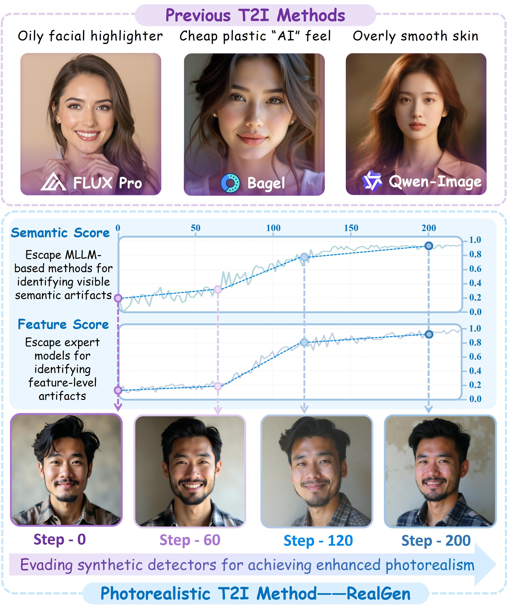

# RealGen: Photorealistic Text-to-Image Generation via Detector-Guided Rewards

## 📰 News
* **[2025.12.02]**  🔥 We have released **RealGen: Photorealistic Text-to-Image Generation via Detector-Guided Rewards**. Check out the **[** [Paper](https://arxiv.org/abs/2512.00473);  **]**. 

## 🏆 Contributions

* ✨ **What did we do?** We propose **RealGen**, a text-to-image generator capable of producing highly convincing photorealistic images. It leverages a Detector Reward-guided GRPO post-training to escape detector identification, thereby reducing artifacts and enhancing image realism and detail.
* 📐 **How to evaluate performance?** We introduce **RealBench**, a new benchmark for evaluating photorealism that achieves human-free automated scoring through Detector-Scoring and Arena-Scoring.
* 🔧 **How effective was it?** RealGen significantly outperforms both general image models (like GPT-Image-1, Qwen-Image) and specialized realistic models (like FLUX-Krea) in realism, details, and aesthetics on the T2I task.

